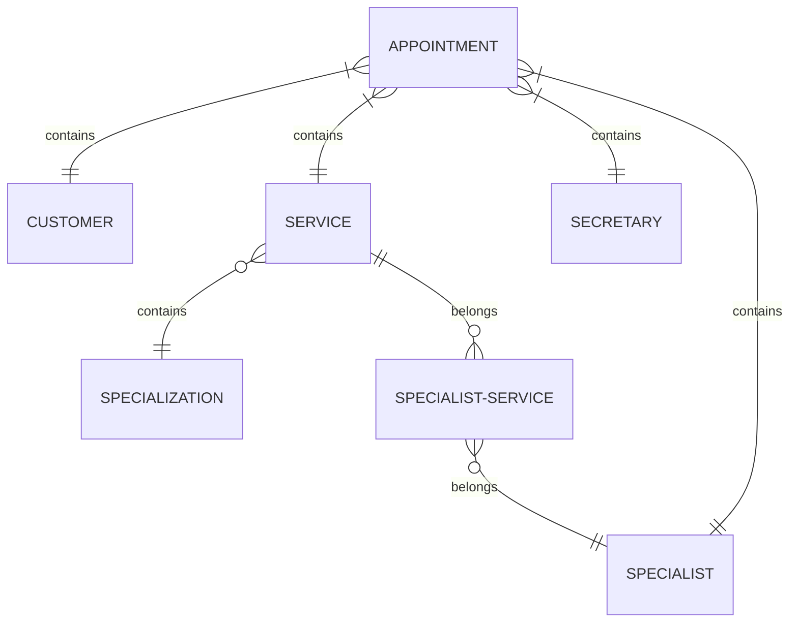

# Objetivo

Em um sistema para agendamentos clínicos, necessitamos das funcionalidades mínimas:

* Administração
    * Cadastro de secretários
        - Nome
        - CPF
        - DDD + Celular

* Secretário
    * Cadastro do cliente
        - Nome
        - CPF
        - DDD + Celular
        - Data de nascimento
    * Cadastro de especialidade
    * Cadastro de especialistas
        - Nome
        - CPF
        - Especialidade
    * Agendamento de horários
    * Listagem dos agendamentos de um dia específico para comunicação prévia

# Diagrama dos Relacionamentos das Entidades

Accesse a plataforma [Mermaid live editor](https://mermaid.live/edit) para atualizar o diagrama.

Neste diagrama podemos ver que um agendamento (APPOINTMENT) contém 1 cliente (CUSTOMERS), 1 serviço (SERVICES) e 1 secretário (SECRETARY) associados, sendo relações somente leitura necessárias para identificar os envolvidos no agendamento.

O serviço do especialista (SPECIALIST-SERVICES) é um catálogo dos serviços (SERVICES) oferecidos pelos especialistas (SPECIALISTS) no período atual. Os valores existentes nessa tabela são copiados para os agendamentos para registrar as informações aplicadas àquela data. Os preços dos serviços são variádos entre os especialistas, que apesar de seguirem uma tabela de valores geral, eles podem ajustar um pouco o preço e a duração que oferecem o serviço. A tabela com os valores gerais ainda precisa ser criada no sistema.

Os serviços (SERVICES) são categorizados em especializações (SPECIALIZATIONS), uma medida para facilitar a exploração e seleção dos interesses dos clientes.
